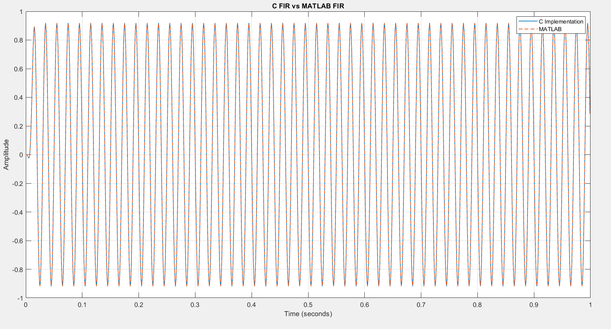
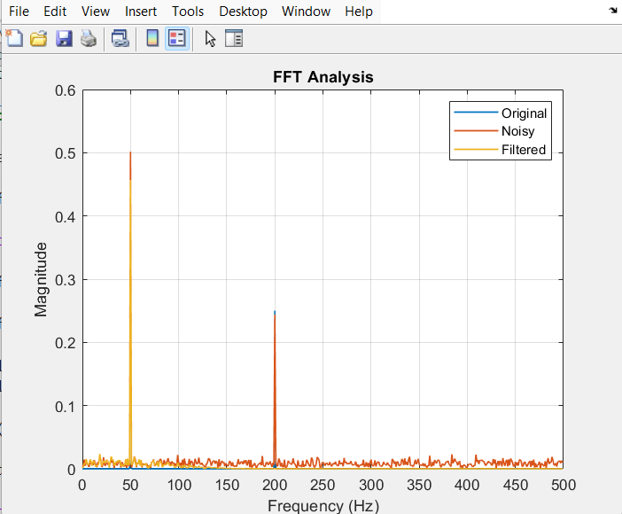

# DSP Signal Processing Toolkit

A digital signal processing project implemented using **C and MATLAB**, demonstrating signal generation, noise modeling, FIR filtering, convolution-based implementation, C-MATLAB verification, and FFT-based frequency analysis.

## Project Overview

This project implements a basic DSP processing pipeline:

**Signal Generation → Noise Addition → FIR Filtering → FFT Analysis**

A composite signal containing **50 Hz and 200 Hz** frequency components is generated and sampled at **1 kHz**. Noise is added to simulate a noisy measurement.

A **21-tap FIR low-pass filter** with a cutoff frequency of approximately **100 Hz** is then designed in MATLAB and implemented manually in C using the convolution equation.

The C implementation is verified against MATLAB by comparing their filtered outputs.

## Features

- Discrete-time signal generation
- Sampling and Nyquist criterion analysis
- Gaussian noise modeling
- FIR low-pass filter design
- Manual FIR filter implementation in C
- MATLAB-based signal processing
- C vs MATLAB output verification
- FFT-based frequency-domain analysis

## System Parameters

| Parameter | Value |
|---|---:|
| Sampling Frequency | 1000 Hz |
| Signal Component 1 | 50 Hz |
| Signal Component 2 | 200 Hz |
| Component 1 Amplitude | 1 |
| Component 2 Amplitude | 0.5 |
| FIR Filter Order | 20 |
| Number of FIR Taps | 21 |
| Cutoff Frequency | 100 Hz |

## DSP Concepts

### 1. Signal Generation

The input signal is:

x[n] = sin(2π50n/Fs) + 0.5sin(2π200n/Fs)

The signal contains frequency components at **50 Hz** and **200 Hz**.

### 2. Sampling

The sampling frequency is:

Fs = 1000 Hz

The highest signal frequency is 200 Hz.

According to the Nyquist criterion:

Fs > 2Fmax

1000 > 400

Therefore, the chosen sampling frequency is sufficient to avoid aliasing for the signal components.

### 3. FIR Filtering

A 21-tap FIR low-pass filter is used with a cutoff frequency of approximately 100 Hz.

The FIR output is calculated using:

y[n] = Σ h[k]x[n-k]

where:

- x[n] = input signal
- h[k] = FIR filter coefficients
- y[n] = filtered output

The FIR equation is implemented manually in C.

### 4. FFT Analysis

FFT is used to analyze the frequency content of the signal.

The spectrum shows the original **50 Hz and 200 Hz** components.

After low-pass filtering, the **50 Hz component is retained** while the **200 Hz component is significantly attenuated**.

## C and MATLAB Verification

The FIR filter was independently implemented in C and compared against MATLAB's FIR filtering result.

The two outputs closely match, providing verification of the C implementation.

## Results


### C vs MATLAB Verification

The C implementation produces an output closely matching MATLAB's FIR filtering result.



### FFT Analysis

The FFT shows the 50 Hz and 200 Hz frequency components. After filtering, the 200 Hz component is significantly reduced.



## Project Structure

```text
DSP-Signal-Processing-Toolkit/
│
├── C/
│   └── fir_filter.c
│
├── MATLAB/
│   ├── fir_filter.m
│   ├── compare_c_matlab.m
│   └── fft_analysis.m
│
├── Results/
│   ├── c_filtered_signal.csv
│   ├── c_vs_matlab.png
│   └── fft_analysis.png
│
└── README.md
